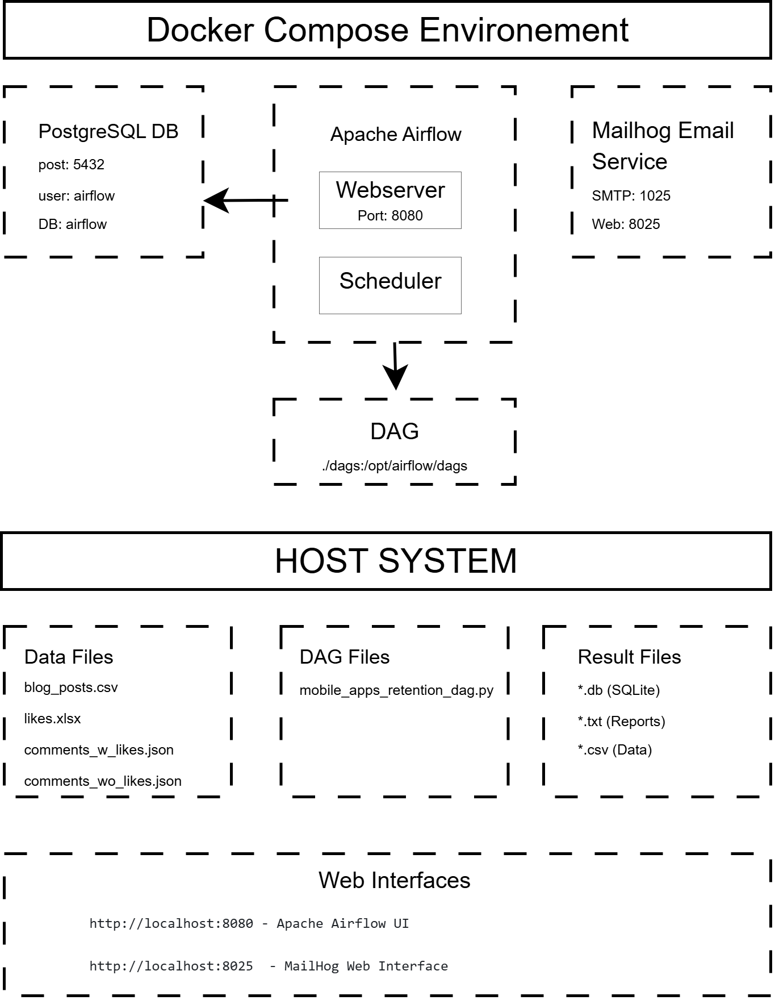
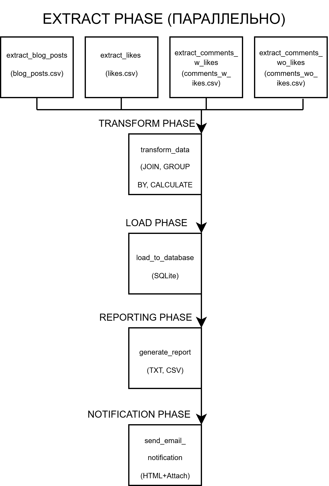

# Лабораторная работа №3. Оркестрация ETL-процессов с Apache Airflow

<br><br>
**_README ЕЩЕ НЕ ДОПИСАН. В ПРОЦЕССЕ._** 

<br>**Студент** Нургалеева Гузель
<br>**Вариант задания** №16
## Бизнес-задача. Рассчитать среднее количество лайков и комментариев на пост для каждой темы.

### Описание проблемы

Определить наиболее интересную тему, для создания контента удерживающего имеющихся пользователей и привлекающих новых пользователей.

### Бизнес-ценность решения

*   📊 **Автоматизация аналитики**. Ежедневный расчет ключевых метрик без участия аналитика.
*   🎯 **Выявление проблемных категорий**. Быстрое определение неинтересных тем.
*   📈 **Принятие решений на основе данных**. Объективная оценка успешности контента.
*   ⏰ **Экономия времени**. Автоматическая обработка данных из разных источников.
*   📧 **Своевременное уведомление**. Автоматическая отправка отчетов заинтересованным лицам.

### Данные и логика расчета

**Исходные данные**

*   **Файл 1 (CSV)**. `blog_posts.csv` — справочник Блог-постов (post_id, author_id, topic).
*   **Файл 2 (Excel)**. `likes.xlsx` — данные о лайках (post_id, user_id).
*   **Файл 3 (JSON)**. `comments_w_likes.json` — данные о комментариях (те пользователи, которые также поставили лайк) (post_id, user_id).
*   **Файл 4 (JSON)**. `comments_wo_likes.json` — данные о комментариях (те пользователи, которые не ставили лайк посту) (post_id, user_id).


**Ожидаемый результат.** Аналитический отчет по темам статей, автоматически отправляемый на email.


## Архитектура решения

### Общая схема системы




<br>



```

### ETL-процесс

```
                    EXTRACT PHASE (Параллельно)
┌─────────────────┐  ┌─────────────────┐  ┌─────────────────┐
│extract_blog_posts  │  │extract_likes |  │extract_comments_w_likes│
│(blog_posts.csv) |  │ (likess.xlsx)   │  │(comments_w_likes│.json)│
└─────────────────┘  └─────────────────┘  └─────────────────┘
         │                     │                     │
         └─────────────────────┼─────────────────────┘
                               │
                    TRANSFORM PHASE
                ┌─────────────────┐
                │ transform_data  │
                │ (JOIN, GROUP BY,│
                │ CALCULATE)      │
                └─────────────────┘
                         │
                    LOAD PHASE
                ┌─────────────────┐
                │load_to_database │
                │ (SQLite)        │
                └─────────────────┘
                         │
                 REPORTING PHASE
                ┌─────────────────┐
                │generate_report  │
                │ (TXT, CSV)      │
                └─────────────────┘
                         │
               NOTIFICATION PHASE
                ┌─────────────────┐
                │send_email_      │
                │notification     │
                │ (HTML + Attach) │
                └─────────────────┘
```

## Технический стек

| Компонент | Технология | Назначение |
|---|---|---|
| **Оркестрация** | Apache Airflow 2.5.0 | Управление ETL-процессами |
| **Контейнеризация** | Docker + Docker Compose | Изоляция и развертывание |
| **База данных (Airflow)** | PostgreSQL 12 | Метаданные Airflow |
| **База данных (Результаты)**| SQLite | Хранение результатов анализа |
| **Обработка данных** | Python 3.8 + Pandas | ETL-логика и трансформации |
| **Работа с Excel** | openpyxl | Чтение Excel файлов |
| **Email-тестирование** | MailHog | Тестирование email-уведомлений |
| **Веб-интерфейс** | Airflow WebUI | Мониторинг и управление |


