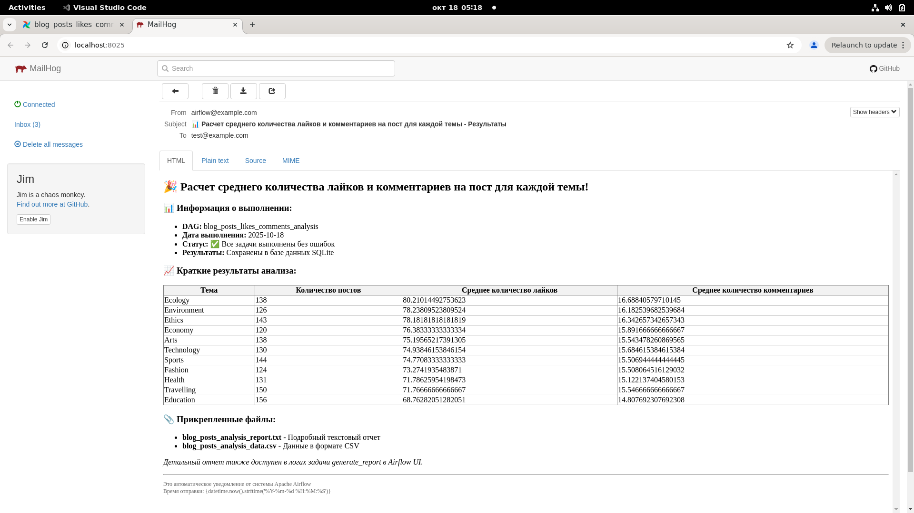
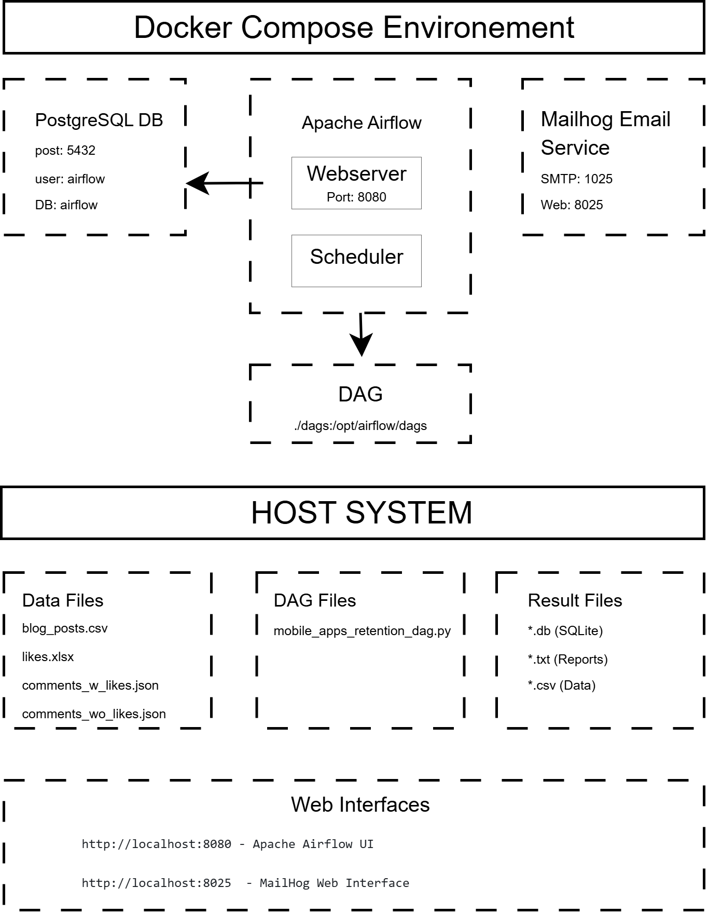
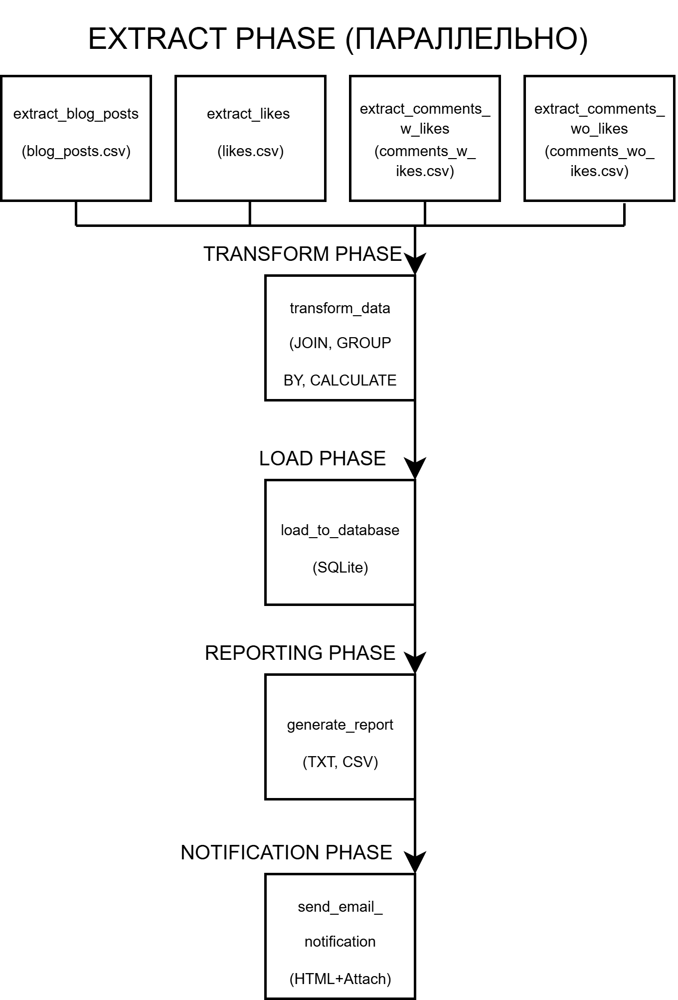
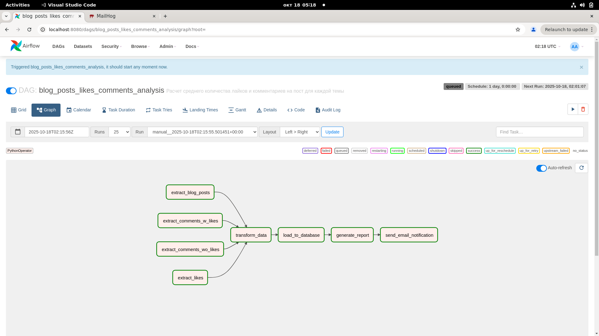
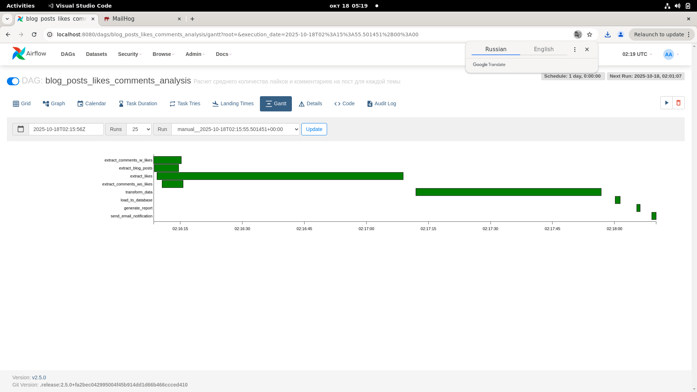

# Лабораторная работа №3. Оркестрация ETL-процессов с Apache Airflow

<br>**Студент** _Нургалеева Гузель_
<br>**Вариант задания** _№16_

## Бизнес-задача. Рассчитать среднее количество лайков и комментариев на пост для каждой темы.

### Описание проблемы

Определить наиболее интересную тему, для создания контента удерживающего имеющихся пользователей и привлекающих новых пользователей.

### Бизнес-ценность решения

*   📊 **Автоматизация аналитики**. Ежедневный расчет ключевых метрик без участия аналитика.
*   🎯 **Выявление проблемных категорий**. Быстрое определение неинтересных тем.
*   📈 **Принятие решений на основе данных**. Объективная оценка успешности контента.
*   ⏰ **Экономия времени**. Автоматическая обработка данных из разных источников.
*   📧 **Своевременное уведомление**. Автоматическая отправка отчетов заинтересованным лицам.

### Данные и логика расчета

**Исходные данные**

*   **Файл 1 (CSV)**. `blog_posts.csv` — справочник Блог-постов (post_id, author_id, topic).
*   **Файл 2 (Excel)**. `likes.xlsx` — данные о лайках (post_id, user_id).
*   **Файл 3 (JSON)**. `comments_w_likes.json` — данные о комментариях (те пользователи, которые также поставили лайк) (post_id, user_id).
*   **Файл 4 (JSON)**. `comments_wo_likes.json` — данные о комментариях (те пользователи, которые не ставили лайк посту) (post_id, user_id).


**Ожидаемый результат.** Аналитический отчет по темам статей, автоматически отправляемый на email.



## Архитектура решения

### Общая схема системы




<br>
### ETL-процесс




## Технический стек

| Компонент | Технология | Назначение |
|---|---|---|
| **Оркестрация** | Apache Airflow 2.5.0 | Управление ETL-процессами |
| **Контейнеризация** | Docker + Docker Compose | Изоляция и развертывание |
| **База данных (Airflow)** | PostgreSQL 12 | Метаданные Airflow |
| **База данных (Результаты)**| SQLite | Хранение результатов анализа |
| **Обработка данных** | Python 3.8 + Pandas | ETL-логика и трансформации |
| **Работа с Excel** | openpyxl | Чтение Excel файлов |
| **Email-тестирование** | MailHog | Тестирование email-уведомлений |
| **Веб-интерфейс** | Airflow WebUI | Мониторинг и управление |

## Пошаговая инструкция запуска

### Шаг 1. Подготовка окружения

1.  **Клонирование проекта**:
    ```bash
    git clone https://github.com/GuzelN-4labs/Lab_3_Python_Apache_Airflow.git
    cd DCCAS/Lab_3_Python_Apache_Airflow
    ```
2.  **Запуск всех сервисов**:
    ```bash
    sudo docker compose up -d
    ```
3.  **Проверка статуса контейнеров**:
    ```bash
    sudo docker ps
    ```
    Должны быть запущены: `webserver`, `scheduler`, `postgres`, `mailhog`.

### Шаг 2. Работа с Apache Airflow

*   **Доступ к веб-интерфейсу**:
    *   **URL**: http://localhost:8080
    *   **Логин/Пароль**: admin/admin
*   **Действия в Airflow UI**:
    1.  **Найдите DAG** `blog_posts_likes_comments_analysis` и убедитесь, что он включен.
    2.  **Запустите DAG** вручную, нажав кнопку "Trigger DAG" (▶️), или дождитесь автоматического запуска.
    3.  **Отслеживайте выполнение** через **Graph View** (визуализация), **Tree View** (история запусков) или **Gantt View** (диаграмма выполнения).
    4.  **Просматривайте логи** выполнения, кликнув на задачу и выбрав "View Log".
 





### Шаг 3. Проверка email-уведомлений в MailHog

*   **Доступ к MailHog**:
    *   **URL**: http://localhost:8025
*   **Что проверять**:
    *   После успешного выполнения DAG в MailHog появится письмо с темой **"📊 Анализ коэффициента удержания мобильных приложений - Результаты"**.
    *   Письмо содержит **HTML-таблицу** с результатами и **прикрепленные файлы**: `blog_posts_analysis_report.txt` и `blog_posts_analysis_data.csv`.
    *   


### Шаг 4. Проверка результатов анализа

Для удобной проверки результатов используйте скрипт `check_results.py`.

1.  **Установка зависимостей**:
    ```bash
    pip install -r requirements.txt
    ```
2.  **Проверка результатов в базе данных** (скрипт скопирует БД из контейнера и выведет данные):
    ```bash
    python3 check_results.py
    ```
3.  **Копирование файлов отчетов** из контейнера на хост-систему:
    ```bash
    python3 check_results.py --files
    ```

### Шаг 5. Остановка сервисов

```bash
sudo docker compose down
```

### Полная очистка проекта

Для полной очистки Docker-окружения (контейнеры, образы, тома) используйте скрипт:

```bash
# Сделать скрипт исполняемым
chmod +x cleanup.sh
# Запустить полную очистку (скрипт запросит подтверждение)
sudo ./cleanup.sh
```

## Результаты выполнения

После успешного выполнения DAG вы получите:

1.  **📧 Email-уведомление** с HTML-таблицей и прикрепленными файлами отчетов.
   
  
  
3.  **📁 Файлы с результатами**:
    *   `blog_posts_analysis_report.txt` — подробный текстовый отчет с рекомендациями.
    *   `blog_posts_analysis_data.csv` — данные в формате CSV для дальнейшего анализа.
    *   `blog_posts_likes_comments_analysis.db` — база данных SQLite с результатами.
4.  **📈 Бизнес-рекомендации**, основанные на анализе данных.

### Текстовый отчет:

```
ОТЧЕТ ПО РАССЧЕТУ СРЕДНЕГО КОЛИЧЕСТВА ЛАЙКОВ НА ПОСТ В РАЗБИВКЕ ПО ТЕМАМ
================================================================
Дата анализа: 2024-10-18

РЕЗУЛЬТАТЫ
ЛУЧШАЯ ТЕМА ДЛЯ ПОСТА: Ecology
находится на  1 месте как по количеству лайков, так и комментариев
СРЕДНЕЕ КОЛИЧЕСТВО ЛАЙКОВ: 80
СРЕДНЕЕ КОЛИЧЕСТВО КОММЕНТАРИЕВ: 17

В ТОП-3 ТЕМ ВХОДЯТ:
1. Ecology
2. Environment
3. Ethics

НА ТРЕХ ПОСЛЕДНИХ МЕСТАХ НАХОДЯТСЯ ТЕМЫ:
1. Health
2. Travelling
3. Education

РЕКОМЕНДАЦИИ: 
Колчиество постов в трех последних темах больше, чем в топ-3:
- Возможно стоит публиковать больше постов по темам, находщим больший отклик у читателей.
- Размещать информацию о сайте также на тех ресурсах, на которых бывают потенциаьльные читатели более заинтресеованные в темах, находщися на последних местах.
 в этом случае, если сайт зарабывает за счет рекламы, он станет более интересен соответвующим  рекламодателям.

В целом, по количеству реакций читалей все темы близки по показателям. Стоит:
1. рассмотреть реакции в разрезе количсества положительных/ отрицательных
2. рассмотреть количество реакций в динамике (наблюдается положитиельная или отрицательная тенденця) 
``` 

## Выводы

### Технические достижения

1.  ✅ **Реализован полный ETL-процесс** с использованием Apache Airflow.
2.  ✅ **Автоматизирована обработка** разнородных данных (CSV, Excel, JSON).
3.  ✅ **Настроена оркестрация задач** с параллельным выполнением.
4.  ✅ **Реализованы email-уведомления** с отправкой отчетов.

### Бизнес-результаты

1.  📊 **Автоматизирован расчет** среднего количества лайков на пост по темам.
2.  🎯 **Выявлены наиболее интересные темы** с разными показателями лайков и комментариев.
3.  📈 **Сформированы рекомендации** для улучшения продуктовой стратегии.
4.  ⏰ **Сокращено время** на подготовку аналитики.

### Практические навыки

*   Проектирование и реализация ETL-процессов.
*   Работа с Apache Airflow (DAGs, операторы, зависимости).
*   Контейнеризация с Docker Compose.
*   Обработка данных с Python и Pandas.


